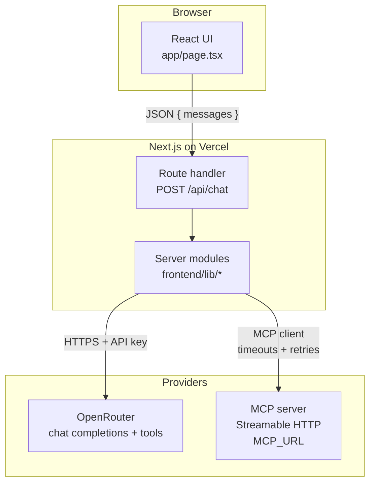
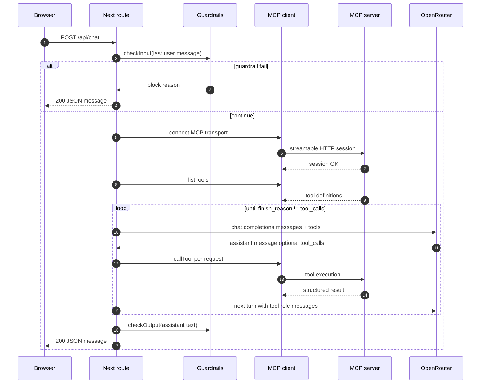
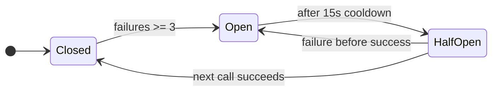

# Meridian Electronics — support chatbot

Customer-facing chat for **Meridian Electronics**: stock and catalog questions, order flows, and account-sensitive actions driven by **live MCP tools** (not static copy). All secrets and provider keys stay **server-side**; the browser only calls `POST /api/chat` on the same origin.

---

## Platform architecture



---

## Chat request lifecycle (`POST /api/chat`)



---

## Resilience

**Model routing** (`frontend/lib/ai.ts`): ordered model list; on `404` / `429` / `500` / `503`, advance to the next model before failing the request.

**MCP session** (`frontend/lib/mcp.ts`): connect retries, per-session wall clock (`MCP_SESSION_TIMEOUT_MS`, default 55s), aligns with `maxDuration` on the route.

**MCP circuit breaker** (`frontend/lib/circuit-breaker.ts`):



---

## Tech stack

| Layer | Technology |
|--------|------------|
| UI | React 19, Next.js 16 App Router, Tailwind CSS 4 |
| API | Route handlers only; no browser exposure of keys |
| LLM | OpenRouter (`OPENROUTER_BASE_URL`), OpenAI-compatible client |
| Tools | `@modelcontextprotocol/sdk` streamable HTTP to `MCP_URL` |
| Safety | Input/output guardrails, structured JSON logs |
| Deploy | Vercel (`vercel.json`), Docker / HF Space (`Dockerfile`) |

---

## Repository layout

```
frontend/
  app/
    page.tsx              # Chat UI (client)
    api/chat/route.ts     # Single POST entrypoint
  lib/
    ai.ts                 # OpenRouter chat + model fallback
    mcp.ts                # MCP connect, session timeout, withMCP helper
    guardrails.ts         # Pre/post message checks
    logger.ts             # JSON lines logging
    circuit-breaker.ts    # MCP failure circuit
    prompts.ts            # System prompt
backend/                  # Standalone Node package (same concepts; not wired into Next imports)
```

---

## Local setup

```bash
git clone https://github.com/solarinayo/meridian-support-chatbot.git
cd meridian-support-chatbot
npm install --prefix frontend
cp frontend/.env.example frontend/.env.local
# set MCP_URL, OPENROUTER_BASE_URL, OPENROUTER_API_KEY in frontend/.env.local
npm run dev
```

`npm run dev` runs `next dev --webpack` inside `frontend/`.

---

## Deploy

| Target | Notes |
|--------|--------|
| **Vercel** | Project root can be repo root or `frontend/`; set env vars to match `.env.example`. See `vercel.json` for install/build overrides if needed. |
| **Docker / HF** | Repo-root `Dockerfile`; pass the same env vars; default listen `7860`. |

---

Built by Ayomide Solarinayo.
